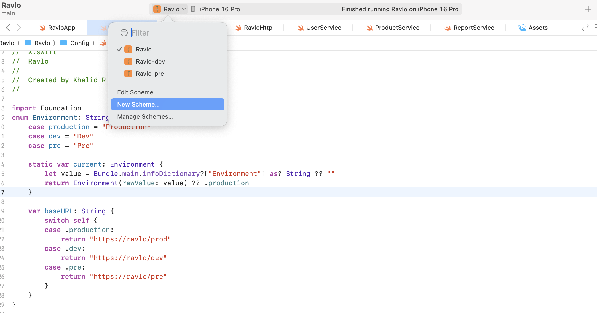
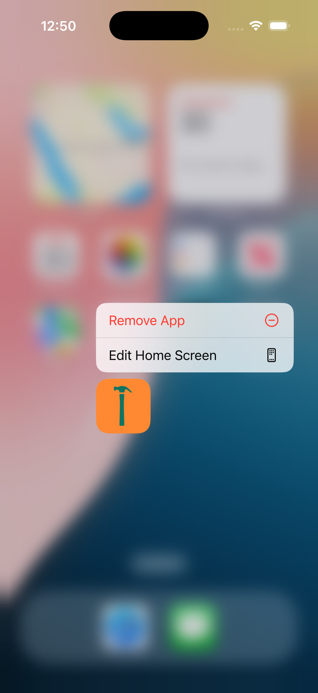

# مشروع iOS  تعدد البيئات (Schemes)

تطبيق واحد، أكثر من بيئة، وكل بيئة لها هوية خاصة!  
كل شيء يتغير تلقائي: الأيقونة، إعدادات الـ API، حتى شكل المشروع في الشاشة الرئيسية يوضح لك أنت وين بالضبط 👇

---

  

---

## 🔥 تنظيم Schemas في Xcode

  

---

## 👀 كيف تشوف الفرق بين البيئات؟

<table>
  <tr>
    <td align="center">
      <b>بيئة المنتج (Production)</b> 
      
    </td>
    <td align="center">
      <b>بيئة التطوير (Dev)</b> 
      
    </td>
  </tr>
</table>

---

## الزبدة

- تقدر تشتغل وتختبر وتصدر تطبيقك براحة، بدون لخبطة ولا خوف من خلط البيئات.
- كل بيئة تضبط لها إعداداتها واللوقو حقها، والكود مرتب وواضح لأي أحد يمر عليه.

---

